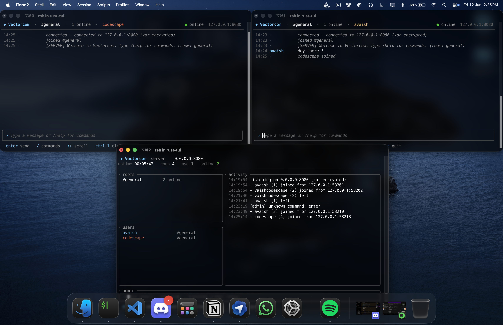

# Vectorcom — Multi-Client Communication System

Vectorcom is a multi-client chat system. The networking core is written in C++ all user interface now lives in a modern Rust **TUI** built with [ratatui](https://ratatui.rs/).



## Quick start

Two commands — each builds everything and launches both the backend and its TUI:

```bash
make server   # build + run the C++ backend AND the Rust dashboard TUI
make client   # build + run the Rust client TUI
```

Override host / port / username on the command line:

```bash
make server PORT=9090
make client HOST=192.168.1.10 PORT=9090 USER=cracked dev
```

`make server` runs the C++ backend headless in the background and attaches the Rust dashboard to it as the live UI; when you quit the dashboard, the backend is stopped.

### Prerequisites

* A C++17 compiler (`g++` or `clang++`) on a POSIX system (Linux, macOS)
* [Rust](https://rustup.rs/) 1.75+ (stable) and `cargo`
* `make`

## Features

### Chat
* **Multi-client** real-time messaging over TCP (thread-per-client on the backend)
* **Rooms** — create and join chat rooms with persistent per-room history
* **Private messages** — direct messages between users
* **Pinned messages** — pin important messages to a room board
* **User list** — see who's online and which room they're in

### Security
* **XOR message encryption** between clients and the backend (shared key)
* **User blocking** — admin-managed; blocked users can't send messages (including PMs)
* **Rate limiting** — spam protection (3 messages/second)
* **Room slowmode** — admin-controlled per-room message cooldown

### Operations
* **Headless C++ backend** — plain-text status logs to stdout, no terminal decoration
* **Admin console** — control the backend from its stdin (`kick`, `say`, `block`, `unblock`, `slowmode`, `list`, `help`)
* **Rust dashboard** — live ratatui view of rooms, users, and activity, with a built-in **admin command prompt** that drives the backend over the wire (`kick`, `say`, `block`, `unblock`, `slowmode`)

## Components

| Path | Role |
|------|------|
| [cpp-server/vector-com.cpp](cpp-server/vector-com.cpp) | C++ backend chat server (headless; admin console on stdin) |
| [cpp-server/client.cpp](cpp-server/client.cpp) | C++ headless protocol relay (no UI) — optional standalone client / engine |
| [rust-tui/](rust-tui/) | Rust workspace: the TUI client and the dashboard server |

### Rust workspace

```text
rust-tui/
├── shared/   # protocol constants + XOR helpers shared by both crates
├── server/   # tokio TCP server + ratatui dashboard + --observe mode
└── client/   # tokio TCP client + ratatui chat UI with auto-reconnect
```

Binaries:
* `vectorcom` — the chat **client TUI** (rounded input box, color-coded users, scrollback, slash commands, graceful reconnect).
* `vectorcom-server` — a chat **server with a dashboard**, plus an `--observe HOST:PORT` mode that attaches read-only to a running C++ backend (this is what `make server` uses).

## Running pieces individually

You normally just use `make server` / `make client`, but the parts can be run on their own.

### C++ backend

```bash
g++ -std=c++17 -O2 -pthread -o vector-com cpp-server/vector-com.cpp
./vector-com            # default port 8080
./vector-com 9090       # custom port
```

The backend logs plain status lines to stdout and reads **admin commands** from stdin:

* `list` — show connected users with IPs and rooms
* `kick <username>` — disconnect a user
* `say <message>` — broadcast to all rooms
* `block <username>` — block a user from sending messages
* `unblock <username>` — unblock a user
* `slowmode <room> <seconds>` — set per-room slowmode
* `help` — show admin commands

### Rust dashboard / client

```bash
cd rust-tui && cargo build --release

# dashboard attached to a running C++ backend
cargo run --release -p vectorcom-server -- --observe 127.0.0.1:8080

# standalone Rust server with dashboard (alternative to the C++ backend)
cargo run --release -p vectorcom-server -- --port 8080

# client TUI
cargo run --release -p vectorcom-client -- --host 127.0.0.1 --port 8080 -u alice
```

The dashboard's `rooms` and `users` panels are reconstructed by polling the
backend's `/list` and `/rooms` replies. Its **admin prompt** (bottom of the
screen) lets you type commands that are relayed to the backend:

| Command | Action |
|---------|--------|
| `kick <user>` | disconnect a user |
| `say <message>` | broadcast a server notice to all rooms |
| `block <user>` | block a user from sending messages |
| `unblock <user>` | unblock a user |
| `slowmode <room> <seconds>` | set per-room slowmode |

Typing `/` opens a **dropdown** listing every admin command with its help text —
`↑`/`↓` to select, `Tab` to complete. `Enter` runs the command, `Esc` clears the
prompt (or quits when empty), `Ctrl-C` quits.
Admin commands travel as `/admin <cmd>` over the socket and are **unauthenticated** —
intended for a trusted local operator, consistent with this project's educational scope.
(Against a standalone Rust server, only `say`, `block`, and `unblock` are supported.)

### C++ headless relay (optional)

[cpp-server/client.cpp](cpp-server/client.cpp) is a UI-less bridge: stdin lines are encrypted to the server, server output is decrypted to stdout verbatim. Useful for scripting or as a minimal reference client.

```bash
g++ -std=c++17 -O2 -pthread -o client cpp-server/client.cpp
./client 8080                       # local; username read from first stdin line
./client 192.168.1.100 8080 alice   # remote; explicit username
```

## Client commands

Type these in the Rust client TUI (most are handled by the backend):

| Command | Action |
|---------|--------|
| `/help` | show available commands |
| `/list` | list online users and their rooms |
| `/rooms` | list active rooms |
| `/join <room>` | join or create a room |
| `/pm <user> <message>` | send a private message |
| `/pin <message>` | pin a message to the room board |
| `/pins` | view pinned messages |
| `/unpin <index>` | remove a pinned message |
| `/clear` | clear the local view (client-side only) |
| `/quit` | disconnect |

Blocking/unblocking is **admin-only** — clients have no blocking permissions.

Typing `/` opens a **dropdown** listing the available commands with their help
text — `↑`/`↓` to select, `Tab` to complete.

### Client TUI shortcuts

| Key | Action |
|-----|--------|
| `Enter` | send message / run command |
| `↑` / `↓` | scroll history |
| `PageUp` / `PageDown` | scroll history by page |
| `Ctrl-L` | clear local history |
| `Tab` | complete the selected command from the `/` dropdown |
| `Esc` | clear input (quit when input is empty) |
| `Ctrl-C` | quit |

## Protocol & security

The wire format is **XOR-encrypted, newline-framed plaintext** over TCP:

1. On connect, the client sends its username as the first message.
2. Each subsequent line is a chat message or a `/command`, XOR-encrypted with the shared key.
3. The server replies with rendered text lines (also XOR-encrypted).

The XOR scheme provides basic obfuscation against casual packet sniffing — it is **educational, not production-grade**. For real deployments, use TLS.

Blocking is enforced server-side: the admin-managed block list is checked before chat broadcasts and private messages are delivered, so blocked users cannot send either.

## Architecture notes

* **Backend:** TCP sockets, POSIX threads (thread-per-client), `std::mutex`-guarded shared state, graceful shutdown on SIGINT/SIGTERM.
* **Rust side:** async Tokio I/O, ratatui rendering, auto-reconnect on the client; the dashboard observes the backend, polls it for roster/room state, and relays admin commands to it.
* The C++ backend frames **one message per `recv`** and XOR-encrypts each `send` from key offset 0, so a client should send messages individually rather than batching many lines into a single TCP segment — which is exactly how the interactive TUI behaves. Under heavy bursts, coalesced segments can garble trailing lines; this is a known limitation of the simple framing.


## License

MIT — see the [LICENSE](LICENSE) file.
